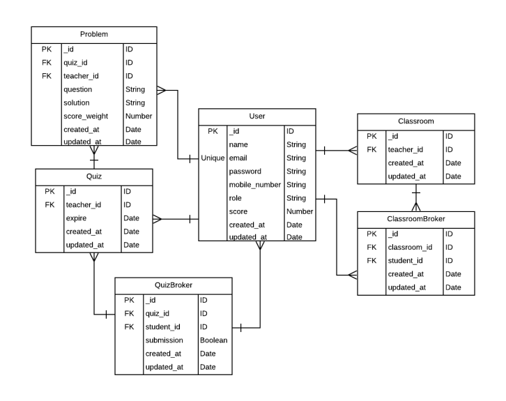

# Quiz gen api

> Backend API for Quiz app for school website.

## E-R diagram



## Version Info

- NodeJS v12.16.3

## Getting Started

Rename "config/config.env.env" to "config/config.env" and update the values/settings to your own

> Install Dependencies

```
$ npm install
```

> Run application

```
# For production mode
$ npm run start

# For development mode
$ npm run dev
```

## ✨Live Demo

The API is live at [herokuapp](https://suhy-quizgen-api.herokuapp.com/api/v1/)

Extensive documentation with examples [here](https://documenter.getpostman.com/view/8001436/TVCcYptf)

- Version: 1.0.0
- Author: Suhyeon Jang
